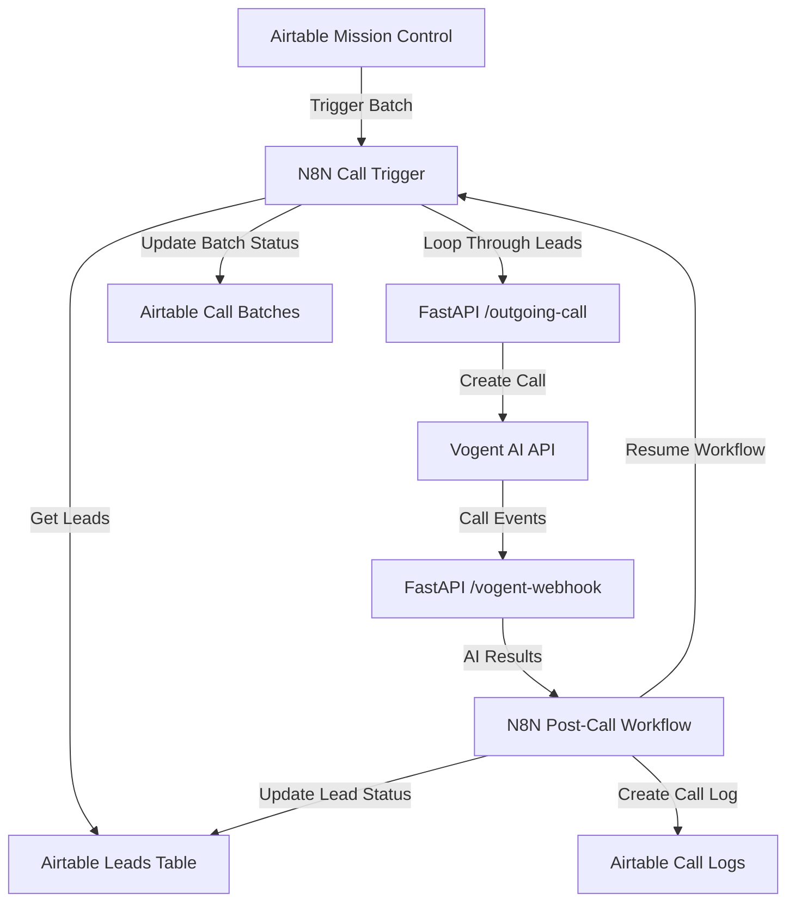

# Technical/Scalability Documentation - Vogent Voice AI Integration

## Table of Contents
1. [System Overview](#system-overview)
2. [Architecture Components](#architecture-components)
3. [Data Flow Architecture](#data-flow-architecture)
4. [N8N Workflow Analysis](#n8n-workflow-analysis)
5. [Scalability Assessment](#scalability-assessment)
6. [Performance Bottlenecks](#performance-bottlenecks)
7. [Scalability Recommendations](#scalability-recommendations)
8. [Monitoring and Maintenance](#monitoring-and-maintenance)
9. [Future Architecture Considerations](#future-architecture-considerations)

## System Overview

The Vogent Voice AI Integration is a webhook-driven system that automates outbound voice calls with AI-powered conversation handling. The system consists of three primary components working in concert:

- **FastAPI Application** (main.py): Core webhook service handling call initiation and completion
- **N8N Workflows**: Orchestration layer managing business logic and data flow
- **Airtable**: Data persistence layer storing leads, batches, and call logs

### System Purpose
- Initiate automated outbound voice calls through Vogent AI
- Process AI-extracted conversation data
- Update lead statuses and maintain call logs
- Support batch processing with resumable workflows

### Architecture Note: Custom Code Layer

**Current Implementation Context:**
The current system includes a custom FastAPI application (main.py) as an intermediary layer between N8N and Vogent. However, **the system could be simplified to work without this custom code** by connecting N8N directly to Vogent's API for both call initiation and webhook handling.

The custom code layer is a remnant from a previous iteration where the system used Ultravox for AI conversations and required real-time streaming between Ultravox and Twilio for telephony. This required programmatic handling of audio streams and complex state management.

The system has since transitioned to Vogent, which provides a more reliable approach without requiring streaming and includes built-in Twilio integration for telephony. **We have kept the custom code as a foundation for future development**, where streaming capabilities might be required depending on future needs or feature requirements.

**Alternative Simplified Architecture:**
```
Airtable → N8N → Vogent API (direct)
Vogent Webhooks → N8N → Airtable (direct)
```

This would eliminate the FastAPI layer entirely while maintaining the same functionality, but would reduce flexibility for future streaming or real-time audio processing requirements.

## Architecture Components

### Current Stack Architecture

The system uses a four-layer architecture optimized for rapid development and internal business use:

#### 1. Database Layer: Airtable
- **Role**: Primary data storage and business logic
- **Tables**: Leads, Call Batches, Call Logs
- **Strengths**: Built-in relationships, user-friendly data management, rapid prototyping
- **Limitations**: API rate limits, limited query complexity, scaling constraints

#### 2. Interface Layer: Airtable Interfaces
- **Role**: User interface for batch management and data visualization
- **Features**: Mission control dashboard, lead & batch management, call log reviews
- **Strengths**: No-code interface creation, integrated with data layer
- **Limitations**: Limited customization, no multi-tenant support

#### 3. Orchestration Layer: N8N
- **Role**: Business process automation and workflow management
- **Functions**: Batch processing, data transformation, webhook handling
- **Strengths**: Visual workflow design, extensive integrations, user-friendly
- **Limitations**: Single-tenant, performance constraints, complex state management

#### 4. Integration Layer: FastAPI Application (main.py)
- **Role**: Bridge between N8N and Vogent API
- **Functions**: Webhook handling, phone number standardization, metadata tracking
- **Strengths**: Async operations, proper error handling, extensible foundation
- **Limitations**: Single-tenant design, manual scaling required

## Data Flow Architecture



### Detailed Flow Steps

1. **Call Initiation Flow**:
   - Mission control triggers batch webhook
   - N8N fetches leads from Airtable (batch filter)
   - Updates batch status to "In-progress"
   - Loops through each lead individually
   - Makes HTTP request to FastAPI `/outgoing-call`
   - FastAPI standardizes phone number and calls Vogent API
   - Waits for call completion via webhook resume

2. **Call Completion Flow**:
   - Vogent sends webhook to FastAPI `/vogent-webhook`
   - FastAPI verifies signature and forwards to N8N
   - N8N fetches full call data from Vogent API
   - Formats transcript and extracts AI results
   - Updates lead status in Airtable
   - Creates detailed call log entry
   - Resumes waiting workflow to continue batch

3. **Batch Management**:
   - Status tracking: Backlog → In-progress → Completed
   - Support for redial batches ("Call back later" leads)
   - Automatic batch completion when all calls finish

## N8N Workflow Analysis

### Call Trigger Workflow Performance

**Current Limitations**:
- **Sequential Processing**: Leads processed one at a time
- **Memory Usage**: All leads for batch loaded into memory simultaneously
- **Error Handling**: Limited retry mechanisms

**Resource Usage**:
```
Estimated per batch:
- Memory: 50MB + (2KB × number_of_leads)
- Network: 5 requests per lead + batch overhead
- Duration: (average_call_time + 30s) × number_of_leads
```

### Post-Call Workflow Performance

**Efficiency Factors**:
- **Fast Processing**: ~5-10 seconds per call completion
- **Atomic Operations**: Each call processed independently
- **Data Transformation**: Minimal computational overhead

## Scalability Assessment

### Current Capacity Analysis

**Single Batch Limits**:
- Maximum leads per batch: ~500 (N8N workflow timeout limits)
- Maximum concurrent batches: 1 (sequential processing design)
- Call duration impact: 3-minute average × 100 leads = 5+ hours per batch

**System Bottlenecks**:

1. **N8N Workflow Engine**:
   - Single-threaded execution per workflow
   - Memory constraints with large datasets
   - Webhook timeout limitations (10 minutes)

2. **FastAPI Application**:
   - ✅ **Well-architected**: Async operations, proper timeouts
   - ✅ **Stateless**: Horizontally scalable
   - ⚠️ **External API limits**: Vogent rate limits unknown

3. **Airtable API**:
   - Rate limits: 5 requests/second per base
   - Record limits: 50,000 records per base
   - Query performance degrades with large datasets

### Growth Projections

| Metric | Current | 10x Growth | 100x Growth |
|--------|---------|------------|-------------|
| Leads/month | 1,000 | 10,000 | 100,000 |
| Concurrent batches | 1 | 5-10 | 50+ |
| Daily call volume | 50 | 500 | 5,000 |
| Infrastructure needs | Current | Enhanced | Redesign Required |


## Scalability Recommendations

### Scalability Issues for future improvement

#### 1. Sequential Processing Bottleneck
- **Issue**: N8N processes leads one at a time within batches
- **Impact**: Linear scaling only; 100 leads = 5+ hours processing time
- **Root Cause**: Loop-based workflow design with synchronous waits

#### 2. Memory Constraints in N8N
- **Issue**: All leads loaded into memory simultaneously
- **Impact**: Workflow failures with large batches (>500 leads)
- **Root Cause**: N8N workflow engine limitations

#### 3. Single-Threaded Orchestration
- **Issue**: Only one batch can be processed at a time
- **Impact**: No concurrent batch processing capability
- **Root Cause**: N8N workflow execution model

#### 4. Database Scaling Limitations
- **Issue**: Airtable API rate limits (5 requests/second)
- **Impact**: Becomes bottleneck at high call volumes
- **Root Cause**: Third-party service constraints

#### 5. Complex State Management
- **Issue**: Webhook resume pattern creates complex dependencies
- **Impact**: Difficult debugging and potential data loss on failures
- **Root Cause**: N8N's limitations in handling long-running processes

### Simplified Architecture Options

### Scaling Strategy: Internal vs Multi-Tenant

#### Internal Business Use (Current + Optimizations)
**Target**: 10x-50x current volume for single organization (OWE)
**Approach**: Build on existing stack with optimizations

**Stack Evolution Path**:
- **Database**: Keep Airtable
- **Interface**: Keep Airtable -> Use 'Data' UI instead of Airtable 'Interfaces' for complex worflows.
- **Orchestration**: Optimize N8N workflows, add parallel processing.
- **Integration**: Scale FastAPI horizontally, add queue systems.

#### Multi-Tenant Solution (Complete Architecture Change)
**Target**: 100x+ current volume serving multiple organizations
**Approach**: Custom-built platform architecture

**Required Stack Changes**:
- **Database Layer**: PostgreSQL/MySQL with proper multi-tenancy
  - Tenant isolation, complex queries, unlimited API usage
  - Data partitioning and sharding capabilities
- **Interface Layer**: Custom React/Vue.js application
  - White-label interfaces, role-based access control
  - Advanced analytics and reporting dashboards
- **Orchestration Layer**: Custom code-based logic
  - Event-driven microservices architecture
  - Horizontal auto-scaling, complex business rules
- **Integration Layer**: Expanded to full platform services
  - API gateway, authentication, billing integration
  - Multi-tenant webhook routing and processing


## Conclusion

The current Vogent Voice AI integration system is well-architected at the application level but faces scalability constraints primarily due to the orchestration layer (N8N) and data storage approach (Airtable). The system can handle current volumes effectively but will require architectural evolution to support significant growth.

**Immediate priorities**:
1. Implement batch partitioning to handle larger volumes
2. Add comprehensive monitoring and alerting
3. Optimize N8N workflows for better memory usage

**Medium-term priorities**:
1. Migrate to a hybrid database approach
2. Implement queue-based processing for true parallelization
3. Add auto-scaling capabilities

**Long-term vision**:
1. Event-driven microservices architecture
2. Multi-region deployment capability
3. Advanced analytics and reporting features

The recommended approach prioritizes maintaining system stability while incrementally improving performance and scalability, ensuring business continuity throughout the evolution process.